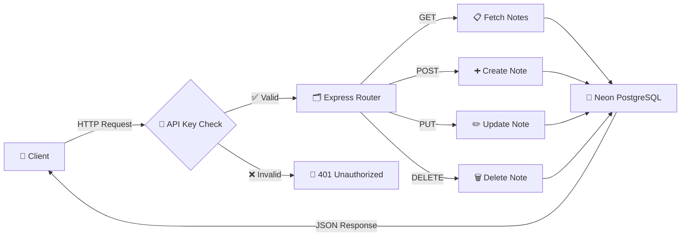

# 📝 Notes API

> ⚡ A blazing fast RESTful API to manage your notes, powered by **Express.js** & **Neon PostgreSQL**

---

## 🏗️ Architecture Flow



---

## 🚀 Quick Start

### 📦 Install

```bash
npm install
```

### ⚙️ Setup

```bash
cp .env.example .env
# Edit .env with your DATABASE_URL and API_KEY
```

### 🗃️ Initialize Database

```bash
npm run db:init
```

### 🌱 Seed Sample Data

```bash
npm run db:seed
```

### 🏃 Run Server

```bash
npm start        # Production
npm run dev      # Development (auto-reload)
```

---

## 🔌 API Endpoints

| Method | Endpoint | Description | Auth |
|:------:|:--------:|:-----------|:----:|
| 🔵 `GET` | `/notes` | Fetch all notes | 🔑 |
| 🔵 `GET` | `/notes/:id` | Fetch a single note | 🔑 |
| 🟢 `POST` | `/notes` | Create a new note | 🔑 |
| 🟡 `PUT` | `/notes/:id` | Update a note | 🔑 |
| 🔴 `DELETE` | `/notes/:id` | Delete a note | 🔑 |

> 🔑 = Requires `x-api-key` header

---

## 📡 Request / Response Examples

### ➕ Create a Note

**Request:**
```bash
POST /notes
```

```json
{
  "title": "🎯 My Goals",
  "content": "Learn Node.js, Build APIs, Ship projects"
}
```

**Response (`201 Created`):**
```json
{
  "id": "a1b2c3d4-e5f6-7890-abcd-ef1234567890",
  "title": "🎯 My Goals",
  "content": "Learn Node.js, Build APIs, Ship projects",
  "created_at": "2025-01-15T10:30:00.000Z",
  "updated_at": "2025-01-15T10:30:00.000Z"
}
```

---

### ✏️ Update a Note

**Request:**
```bash
PUT /notes/{id}
```

```json
{
  "title": "🚀 Updated Goals",
  "content": "Master backend development"
}
```

**Response (`200 OK`):**
```json
{
  "id": "a1b2c3d4-e5f6-7890-abcd-ef1234567890",
  "title": "🚀 Updated Goals",
  "content": "Master backend development",
  "created_at": "2025-01-15T10:30:00.000Z",
  "updated_at": "2025-01-15T11:00:00.000Z"
}
```

---

## 🛡️ Authentication

Every request requires the `x-api-key` header:

```bash
curl http://localhost:3000/notes \
  -H "x-api-key: your-secret-api-key"
```

❌ Missing/Invalid key → `401 Unauthorized`

---

## 📊 Database Schema

```
┌─────────────────────────────────────────────┐
│                  📝 notes                    │
├─────────────────┬───────────────────────────┤
│ id              │ UUID (PK, auto-generated) │
│ title           │ TEXT (required)            │
│ content         │ TEXT (default: '')         │
│ created_at      │ TIMESTAMP WITH TIME ZONE   │
│ updated_at      │ TIMESTAMP WITH TIME ZONE   │
└─────────────────┴───────────────────────────┘
```

---

## 🧪 Testing with cURL

```bash
# 📋 Get all notes
curl http://localhost:3000/notes -H "x-api-key: YOUR_KEY"

# 📖 Get one note
curl http://localhost:3000/notes/{id} -H "x-api-key: YOUR_KEY"

# ➕ Create a note
curl -X POST http://localhost:3000/notes \
  -H "Content-Type: application/json" \
  -H "x-api-key: YOUR_KEY" \
  -d '{"title":"Hello","content":"World"}'

# ✏️ Update a note
curl -X PUT http://localhost:3000/notes/{id} \
  -H "Content-Type: application/json" \
  -H "x-api-key: YOUR_KEY" \
  -d '{"title":"Updated"}'

# 🗑️ Delete a note
curl -X DELETE http://localhost:3000/notes/{id} \
  -H "x-api-key: YOUR_KEY"
```

---

## 🏗️ Project Structure

```
NotesAPI/
├── 📄 index.js          # Main server & routes
├── 📄 db.js             # Neon DB connection
├── 📄 db-init.js        # Database table creation
├── 📄 seed.js           # Sample data seeder
├── 📄 .env              # Environment variables
├── 📄 .env.example      # Env template
├── 📄 package.json      # Dependencies & scripts
└── 📄 .gitignore        # Git ignore rules
```

---

## 🎛️ npm Scripts

| Command | Description |
|:--------|:-----------|
| `npm start` | 🏃 Start production server |
| `npm run dev` | 🔧 Start with auto-reload |
| `npm run db:init` | 🗃️ Create database tables |
| `npm run db:seed` | 🌱 Insert sample data |

---

## 🛠️ Tech Stack

<div align="center">

| Layer | Technology | Icon |
|:-----:|:----------:|:----:|
| 🖥️ **Runtime** | Node.js | 🟢 |
| 🌐 **Framework** | Express.js | ⚡ |
| 🗃️ **Database** | Neon PostgreSQL | 🐘 |
| 🔐 **Auth** | API Key | 🔑 |
| ⚙️ **Config** | dotenv | 📝 |

</div>

---

## 📈 API Status Codes

```
✅ 200  —  Success
🆕 201  —  Created
🚫 400  —  Bad Request
🔒 401  —  Unauthorized (invalid API key)
❌ 404  —  Not Found
💥 500  —  Server Error
```

---

## 🌟 Features

- ✨ Clean RESTful API design
- 🔐 API Key authentication
- 🐘 Serverless PostgreSQL via Neon
- 🔄 Auto-generated UUIDs
- 📅 Timestamps on all records
- 🌱 One-command data seeding
- 🔥 Development auto-reload
- 💨 Lightweight & fast

---

<div align="center">

**Built with ❤️ using Node.js + Express + Neon**

📝 *Notes API v1.0.0*

</div>
